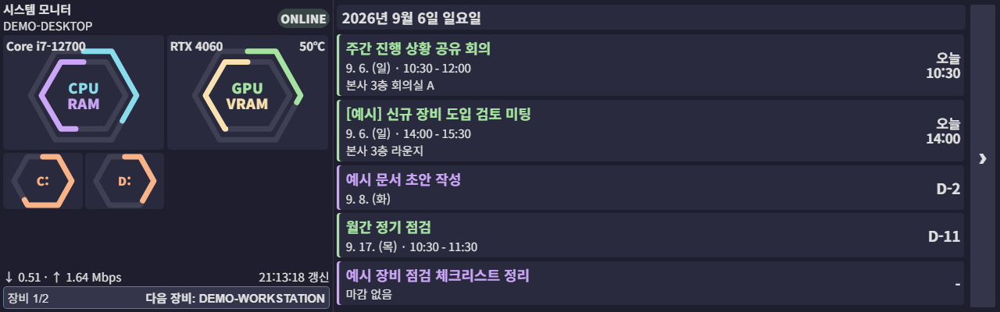
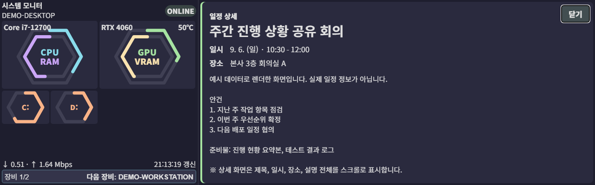
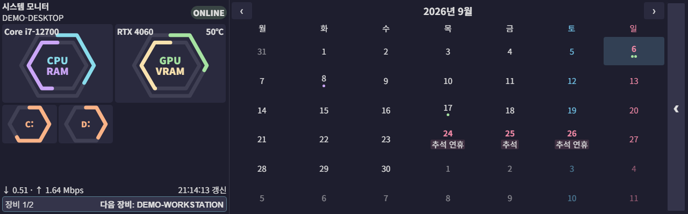

# rpi-calendar-kiosk

Raspberry Pi 4와 Waveshare HDMI 패널에서 Windows PC 시스템 지표와 구글 캘린더 일정을 표시하는 웹 키오스크입니다. 운영 서버와 Windows 지표 송신기는 Rust 0.4.0 기반이며, Python 구현은 최초 OAuth 인증과 로컬 회귀 검증에만 사용합니다.

- 1열: 수치 없는 대형 CPU·RAM 이중 육각링, GPU·VRAM 이중 육각링, 드라이브 문자별 육각링과 중앙 색상 범례
- 육각링 진행선: dash 반복 없이 사용량만큼의 단일 부분 경로를 표시하고 새 지표 수신마다 시작점 회전
- 링 회전 방향: 외부 링 시계방향, 내부 링 반시계방향
- 링 갱신 애니메이션: 시작 위치와 사용량 길이를 800ms 동안 부드럽게 보간
- 2열 + 3열: 1열 D-Day 일정·할일 목록
- 일정 화면 우측 세로 `›` 버튼: 2열 + 3열 범위에 월간 달력 표시
- 달력 화면 우측 세로 `‹` 버튼: 일정 목록 복귀
- 일정 터치: 2열 + 3열 범위에 제목·일시·장소·설명 전체 스크롤 표시
- 일정·할일 배지 제거, 분류별 제목 색상 적용
- 최소 글자 크기 15px, 상세 본문 기준 단일 텍스트 색상 적용
- 5분 주기 백그라운드 폴링, 네트워크 오류 시 **디스크 캐시**에서 즉시 표시
- 2초 주기 PC 시스템 지표 업데이트
- Windows 물리 파티션에 연결된 드라이브만 표시하고 Google Drive 등 가상 볼륨 제외
- 표시 순서가 가장 앞선 장비를 기본으로 두고, 하단 전체 너비 버튼으로 등록된 PC를 순환 표시
- Windows GUI 하위 시스템 Rust 송신기와 숨김 예약 작업으로 터미널 창 없는 상시 수집
- CPU·GPU 대비 너비와 높이가 각각 절반인 스토리지 카드
- 짧은 하드웨어 이름, 수집값이 있을 때만 표시되는 온도, 일정·달력 슬라이드 전환
- CSS `clamp() / vmin / vw`로 해상도·방향(가로/세로) 자동 적응
- **systemd user service + labwc autostart**로 부팅 시 자동 실행, 비정상 종료 시 5초 후 자동 재시작

## 화면

> 아래 이미지는 모두 **더미 데이터**로 렌더한 예시이며 실제 개인 일정·계정 정보는 포함하지 않습니다. 실사용 패널과 동일한 1280×400 해상도로 촬영했습니다.

**실사용 디스플레이: Waveshare HDMI 400×1280 패널, Chromium 기준 1280×400 가로**



**일정 터치 상세 화면**



**월간 달력 화면**



운영 화면은 1열 시스템 모니터와 나머지 영역의 1열 일정 목록 구성입니다. 각 화면 우측의 좁고 긴 화살표 버튼으로 일정과 달력을 전환합니다. 일정 항목을 터치하면 같은 영역에 상세 내용이 표시됩니다.

## 환경

- 타깃: Raspberry Pi 4, Debian 12 Bookworm, Wayland (labwc), Rust stable, Chromium 138+
- 패널: Waveshare HDMI 400x1280 @ 60.23Hz, Transform 270 (컴포지터 회전 후 1280x400 가로)
- 개발: Windows 11 + Rust stable + Python 3.11 + uv
- Python 호환 계층: `google-api-python-client`, `google-auth-oauthlib`, `psutil`, `rich`

## 빠른 시작

### 로컬 (Windows)

```powershell
# 의존성
uv sync

# OAuth 최초 인증 (브라우저 동의 → secrets/token.json 생성)
# 사전: Google Cloud Console 에서 OAuth Desktop Client 발급 → secrets/credentials.json 으로 저장
# 사전: 같은 콘솔에서 Google Calendar API 를 Enable
uv run python -m soma0sd_rpi_schedule --auth

# 개발 모드 (HTTP 서버만 띄우고 별도 브라우저에서 http://127.0.0.1:8765)
cargo run --bin rpi-schedule-kiosk -- --serve-only --host 127.0.0.1

# 테스트
cargo test --all-targets
uv run pytest
```

### RPi 배포·서비스 등록

배포 대상은 환경 변수로 지정합니다. 저장소에는 실제 호스트 별칭·주소를 두지 않습니다.

```powershell
$env:SOMA0SD_RPI_HOST = "<라즈베리파이 ssh 별칭 또는 user@host>"
$env:SOMA0SD_WINDOWS_HOST = "<지표 송신기를 설치할 Windows PC ssh 별칭>"
$env:SOMA0SD_MONITOR_TARGET = "http://<라즈베리파이 주소>:8765/api/system"
$env:SOMA0SD_SSH_CONFIG = "<별칭이 정의된 ssh config 경로>"  # 표준 ~/.ssh/config 면 생략
```

반복 사용한다면 위 변수를 `.claude/deploy-local.ps1`(git 비추적)에 적어 두면 됩니다. `scripts/_ssh_config.ps1`이 자동으로 읽습니다.

```powershell
pwsh scripts/deploy.ps1               # Rust 소스 동기화 + RPi release 빌드
pwsh scripts/push_token.ps1           # Google token.json 배포 (최초 1회)
pwsh scripts/install_host_monitor.ps1 # 데이터 호스트 송신기 설치, 표시 순서 0
pwsh scripts/install_remote_host_monitor.ps1 # 원격 Windows 송신기 설치, 표시 순서 1
pwsh scripts/install_service.ps1      # Rust systemd user service 전환 + 상태 검증
```

USB-C 연결은 Raspberry Pi 전원 공급에 사용하며 시스템 지표는 내부 LAN의 서명된 HTTP 푸시로 전송합니다. PC 로그인 시 `rpi-calendar-host-monitor` 예약 작업이 시작되고, Pi에서는 `rpi-calendar-kiosk.service`가 자동 실행됩니다.

> [!IMPORTANT]
> 지표 푸시 규약이 공유 토큰 헤더에서 HMAC 서명으로 바뀌었습니다(v0.4.0). 서버와 송신기의 버전이 다르면 푸시가 401로 거절되므로 `deploy.ps1`(Pi 서버) 실행 후 이어서 `install_host_monitor.ps1`·`install_remote_host_monitor.ps1`(송신기)을 실행해 양쪽을 함께 갱신합니다. 그 사이 지표만 잠시 OFFLINE으로 표시되며 일정 표시는 영향받지 않습니다.

### 접근 범위

| 대상 | 노출 범위 | 근거 |
|---|---|---|
| UI, `/api/state`, `/healthz` | **루프백 전용** | 개인 일정·할일 원문이 담기므로 키오스크 본체에만 응답하고, 그 외 접속에는 403 |
| `POST /api/system` | LAN 허용 | 지표 송신기용. 요청마다 HMAC-SHA256 서명 검증 |
| 모든 요청 | Host 헤더 검증 | 도메인 이름 Host는 400. 브라우저 DNS 리바인딩으로 루프백 정책을 우회하지 못하게 차단 |

지표 푸시는 `HMAC-SHA256(token, "<unix timestamp>\n<body>")`을 `X-Monitor-Signature` 헤더로 보냅니다. 공유 비밀 자체는 회선에 오르지 않으며, 타임스탬프 허용 범위(120초)를 벗어난 요청은 거절해 재전송 창을 좁힙니다.

서비스 설치 중 검증 실패 시 설치 스크립트가 임시 보존한 직전 서비스 정의로 자동 복구하며, 성공 시 임시 복구본을 제거합니다.

운영:
```powershell
ssh $env:SOMA0SD_RPI_HOST 'systemctl --user status rpi-calendar-kiosk.service'
ssh $env:SOMA0SD_RPI_HOST 'systemctl --user restart rpi-calendar-kiosk.service'
ssh $env:SOMA0SD_RPI_HOST 'journalctl --user -u rpi-calendar-kiosk.service -f'
```

## 구조

```
rust/src/
├── bin/kiosk.rs        # RPi HTTP 서버 + Chromium 키오스크 실행
├── bin/monitor.rs      # 창 없는 Windows 지표 송신기
├── calendar.rs, google.rs, monitor.rs, server.rs
├── signature.rs        # 지표 푸시 HMAC 서명 규약
└── config.rs
web/
├── index.html          # 운영 화면 구조
├── style.css           # 반응형 레이아웃과 전환 애니메이션
└── app.js              # 모니터·일정·달력 렌더링
src/soma0sd_rpi_schedule/
├── cli.py              # --kiosk / --serve / --auth / --print-resolution
├── server.py           # Python 호환 서버
├── signature.py        # Rust 와 동일한 HMAC 서명 규약
├── config.py, display.py, time_utils.py
├── calendar/           # OAuth, API 클라이언트, 캐시, 모델
scripts/
├── deploy.ps1, push_token.ps1, install_service.ps1
├── install_host_monitor.ps1, install_remote_host_monitor.ps1
├── rpi-calendar-kiosk.service     # systemd user unit (+ screen-off/on .service/.timer)
└── setup_service.sh               # 원격 setup 부트스트랩
tests/                  # Python 호환 계층 회귀 테스트
secrets/                # credentials.json, token.json  (gitignore)
```

## 디자인 결정

- **PyQt6 없음**: 초기 버전(v0.1)의 풀스크린 이슈 이후 v0.2에서 웹 UI + Chromium 키오스크로 전환
- **풀스크린은 컴포지터에 위임**: Chromium `--kiosk --ozone-platform=wayland`가 풀스크린, 데코, 커서 처리
- **Chromium 자동번역과 세션복구 풍선 차단**: HTML `translate="no"`, `<meta name="google" content="notranslate">`, 격리 프로필, Preferences, Managed Policies 적용
- **Rust 단독 운영**: 단일 바이너리 서버와 창 없는 송신기로 RPi·Windows 운영 Python 프로세스 제거
