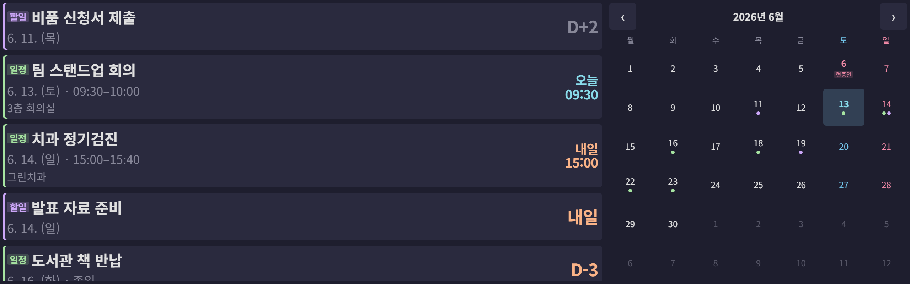
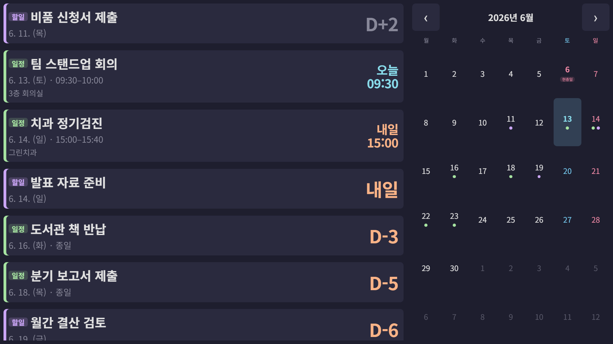
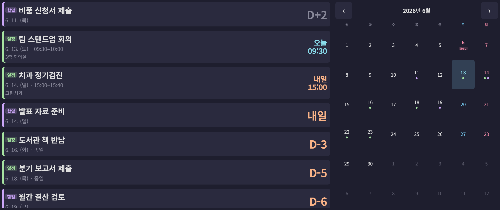

# rpi-calendar-kiosk

라즈베리 파이 4 + Waveshare HDMI 패널 키오스크에서 **구글 캘린더**를 동기화해 D-Day와 월간 일정을 보여주는 **웹뷰 키오스크** 앱 (Python stdlib HTTP 서버 + chromium --kiosk).

- 좌측(약 ⅔): 가장 가까운 일정의 **D-Day** + 향후 일정 목록 (스크롤)
- 우측(약 ⅓): **해당 월 달력** + 일정 인디케이터 (점·배지)
- 5분 주기 백그라운드 폴링, 네트워크 오류 시 **디스크 캐시**에서 즉시 표시
- CSS `clamp() / vmin / vw`로 해상도·방향(가로/세로) 자동 적응
- **systemd user service + labwc autostart**로 부팅 시 자동 실행, 비정상 종료 시 5초 후 자동 재시작

## 화면

> 아래는 모두 **더미 데이터**로 렌더한 예시다 — 실제 개인 일정·계정 정보는 없다. 모든 사이즈가 `vmin/vw/clamp` 비율이라 해상도·비율에 자동 적응한다.

**실사용 디스플레이 — Waveshare HDMI 400×1280 패널 (컴포지터 Transform 90 회전 후 chromium 이 보는 1280×400 가로)**



**16:9 (1920×1080)**



**21:9 (2560×1080)**



좌측은 일정(초록)·할일(보라) 통합 목록 + D-Day 배지(오늘/내일/D-n/D+n), 우측은 월간 달력(토 파랑·일/공휴일 빨강, 오늘 강조, 일정·할일 점·배지). 비율이 넓어질수록 목록 항목이 더 많이 보이고 달력 셀이 커진다.

## 환경

- 타깃: Raspberry Pi 4, Debian 12 Bookworm, Wayland (labwc), Python 3.11, chromium 138+
- 패널: Waveshare HDMI 400x1280 @ 60.23Hz, Transform 90 (컴포지터 회전 후 1280x400 가로)
- 개발: Windows 11 + Python 3.11 + uv
- 의존성: `google-api-python-client`, `google-auth-oauthlib`, `rich` — stdlib 우선, GUI 툴킷 없음

## 빠른 시작

### 로컬 (Windows)

```powershell
# 의존성
uv sync

# OAuth 최초 인증 (브라우저 동의 → secrets/token.json 생성)
# 사전: Google Cloud Console 에서 OAuth Desktop Client 발급 → secrets/credentials.json 으로 저장
# 사전: 같은 콘솔에서 Google Calendar API 를 Enable
uv run python -m soma0sd_rpi_schedule --auth

# 개발 모드 (HTTP 서버만 띄우고 별도 브라우저에서 http://127.0.0.1:8765)
uv run python -m soma0sd_rpi_schedule --serve

# 테스트
uv run pytest
```

### RPi 배포·서비스 등록

```powershell
pwsh scripts/deploy.ps1           # 코드 동기화 + 원격 uv sync
pwsh scripts/push_token.ps1       # token.json 만 RPi 로 (최초 1회)
pwsh scripts/install_service.ps1  # systemd user service 등록 + labwc autostart 추가
```

이후 RPi 가 부팅되거나 labwc 가 재시작될 때마다 키오스크가 자동으로 뜬다. 비정상 종료 시 5초 후 재시작.

운영:
```powershell
ssh 1.66-RPi4-Display 'systemctl --user status rpi-calendar-kiosk.service'
ssh 1.66-RPi4-Display 'systemctl --user restart rpi-calendar-kiosk.service'
ssh 1.66-RPi4-Display 'journalctl --user -u rpi-calendar-kiosk.service -f'
```

## 구조

```
src/soma0sd_rpi_schedule/
├── cli.py              # --kiosk / --serve / --auth / --print-resolution
├── server.py           # stdlib http.server + 백그라운드 동기화 스레드
├── config.py, display.py, time_utils.py
├── calendar/           # OAuth, API 클라이언트, 캐시, 모델
└── static/             # index.html, style.css, app.js  (vanilla, vmin/clamp)
scripts/
├── deploy.ps1, push_token.ps1, install_service.ps1
├── rpi-calendar-kiosk.service     # systemd user unit (+ screen-off/on .service/.timer)
└── setup_service.sh               # 원격 setup 부트스트랩
tests/                  # pytest (58 케이스)
secrets/                # credentials.json, token.json  (gitignore)
```

## 디자인 결정

- **PyQt6 없음** — 초기 버전(v0.1)에 PyQt6 풀스크린 이슈(긴 에러 메시지가 라벨을 가로로 펼쳐 윈도가 풀스크린에서 빠지는 버그)를 경험한 뒤 v0.2 에서 웹뷰 + chromium --kiosk 로 전환.
- **풀스크린은 컴포지터에 위임** — chromium `--kiosk --ozone-platform=wayland` 가 풀스크린·데코·커서 모두 처리. labwc 는 컴포지터 역할만.
- **chromium 자동번역/세션복구 풍선 4중 차단** — HTML `translate="no"` + `<meta name="google" content="notranslate">` + 격리 `--user-data-dir` + Preferences `translate.enabled=false` + Managed Policies `TranslateEnabled=false`. chromium 138 에서 `--disable-features=Translate` 만으로는 부족함.
